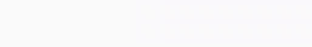

# 🍪snackstack logger 📰
*Easy logging to **human targets** from anywhere in your Vue/Vuetify application.*


> 📌 watch stacking order: queuing time vs. deliver order

*snackstack* enables you to log short information to your users, using a snackbar. The logger automatically registers and makes itself available in all Vue components.

## features
* global logger backend for all Vue components
* automatic injection into all components
* prioritizing message delivery: *error* > *warning* > *info*

## install
```shell
# using node and bundler
npm install snackstack-logger-vuetify-vuex
```
```html
<!-- browser /-->
<script src="https://unpkg.com/snackstack-logger-vuetify-vuex@^0.1"></script>
<!-- OR /-->
<script src="https://cdn.jsdelivr.net/npm/snackstack-logger-vuetify-vuex@0.1.x/bundle/snackstack-logger-vuetify-vuex.umd.min.js"></script>
```

**depends:**
> * *Vue*
> * *Vuetify*
> * *Vuex*
## use
> 📌 provide a *Vuex* instance and store. Vuex store is expected to use default `store` name.

> 📌 for a **full example** take a look at `dev/` and `demo/` directories.

### **init** *snackstack*
*When using via node and bundler only!*
```js
// main.js/index - somewhere you init your Vue root instance
import SnackStackLogger from 'snackstack-logger-vuetify-vuex';
Vue.use(SnackStackLogger);
```
Using *snackstack* from a `<script>`-tag directly in your page will auto install and register. This requires global Vue and Vuex to be available (`window.Vue`, `window.Vuex`).
### **add** the *snackstack*
```html
<!--
  somewhere between <v-app>...</v-app> - best @root-level
/-->
<snack-stack />
```

## config
### API
```js
Vue.use(SnackStackLogger, 'loggername')
```
When installing the plugin to your Vue instance, you may pass an optional string parameter to change the logger *namespace*. Providing `'loggername'` would make the logger available as `loggername.<log|info|warn|error>()`.

### display
All properties regarding layout and display are configured as component properties.
```html
<!-- default values /-->
<snack-stack
  :stacksize="2"
  :timeout="4000"
  :deadtime="0"
  :dark="false"
  :transparency="false"
  :buttontext="null"
/>
```
* `stacksize`: size of "card-stack", when multiple messages are queued
* `timeout`: default auto-hide/close timeout
* `deadtime`: time to hide the whole stack when switching to next message (gives "pop"-effect)
* `dark`: optimize for sites with dark theme; changes stack coloring
* `transparency`: add transparency to lower cards in stack
* `buttontext`: text for the *close-button*; default is a close icon (*like:* ❌)

## use
from any Vue component, call logger as below. When logger namespace has been renamed (see above), replace `logger` with new name.
```js
logger.log('info message')
logger.info('info message')
logger.warn('warning')
logger.error('error')
```
**example**
```html
<v-btn @click="logger.info('✨ info message')">log</v-btn>
```
logger is scoped to component instances (not a global variable):
```js
// Vue component
// ...
  methods: {
    // ...
    do_log() {
      this.logger.log('✨ info message');
    }
  }
// ...
```
### advanced usage
Log methods take either strings or objects as parameters. Using an object, you may use following keys/options:
* `text` **[required]**: log message
* `timeout`: timeout in ms for message to auto-hide; `-1` for infinite

